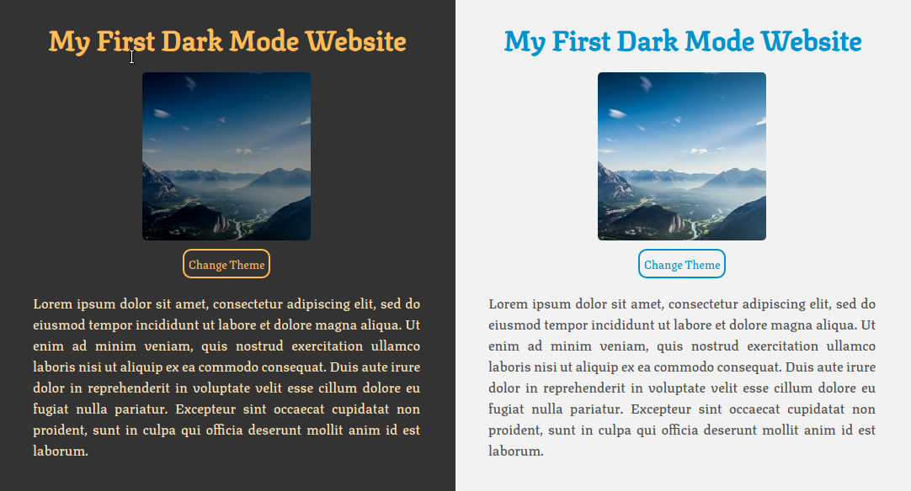

# :mortar_board: Dark Mode Basics :moon:

In this guide, while you build the webpage of above, you will learn how to use CSS variables, identify if the user has dark mode enabled in his operative system or browser, use Javascript to change the theme, and save the chosen theme by the user with local storage.