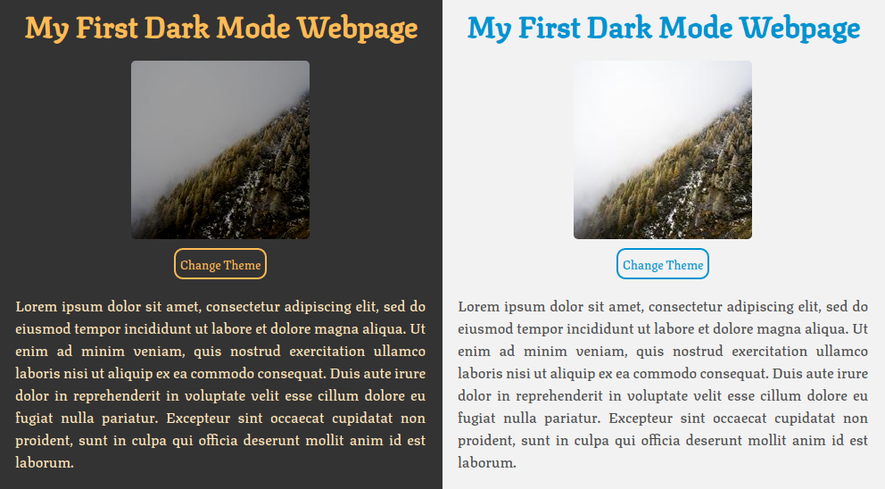

<div align="center">

# :mortar_board: Dark Mode Basics :moon: <!-- omit in toc -->



</div>

In this guide, while you build the webpage of above, you will learn how to use CSS variables, identify if the user has dark mode enabled in his operative system or browser, use Javascript to change the theme, and save the chosen theme by the user with local storage.

## Table of Contents <!-- omit in toc -->
- [1. HTML](#1-html)
- [2. CSS](#2-css)
  - [2.1. Variables](#21-variables)
  - [2.2. Color preferences](#22-color-preferences)
  - [2.3. Layout and colors](#23-layout-and-colors)
- [3. Javascript](#3-javascript)
- [3.1. Local Storage](#31-local-storage)
- [3.2. Element Class List](#32-element-class-list)
- [3.3. Code](#33-code)
- [4. More to learn](#4-more-to-learn)

## 1. HTML
The structure defined for this webpage is simple because we only need to show some information to see the differences when we swap between the dark theme and the light theme. You can see the code below:

```html
<!DOCTYPE html>
<html lang="en">
  <head>
    <meta charset="UTF-8" />
    <meta name="viewport" content="width=device-width, initial-scale=1.0" />
    <title>My First Dark Mode Webpage</title>
    <link rel="stylesheet" href="./assets/css/styles.css" />
  </head>
  <body>
    <h1 class="title">My First Dark Mode Webpage</h1>
    <div>
      
    </div>
    <button id="Changer" class="btn">Change Theme</button>
    <p class="text">
      Lorem ipsum dolor sit amet, consectetur adipiscing elit, sed do eiusmod
      tempor incididunt ut labore et dolore magna aliqua. Ut enim ad minim
      veniam, quis nostrud exercitation ullamco laboris nisi ut aliquip ex ea
      commodo consequat. Duis aute irure dolor in reprehenderit in voluptate
      velit esse cillum dolore eu fugiat nulla pariatur. Excepteur sint occaecat
      cupidatat non proident, sunt in culpa qui officia deserunt mollit anim id
      est laborum.
    </p>
    <script src="./assets/js/app.js"></script>
  </body>
</html>

```
I use [this website](https://www.lipsum.com/) to generate the Lorem Ipsum and [Lorem Picsum](https://picsum.photos/) to show a random square image. 

## 2. CSS
I used one CSS file to define the styles because the webpage is small but, in larger projects, I recommend using a CSS file dedicated only to the webpage colors.

### 2.1. Variables
The variables store the colors of the dark and light theme. In this case, I define four variables to save the background color, the primary color, the text color, and the image filter. The variables for the light theme are the following:  

```css
--bg-color: #f2f2f2;
--primary-color: #0093d0;
--text-color: #4f4f4f;
--filter: none;
```

Is important to mention that is a good practice reduce the brightness and contrast of the images so that they look comfortable to the eyes at the moment that a user swap from light to the dark theme, with this in mind, you can see the variables below:

```css
--bg-color: #333333;
--primary-color: #ffbb55;
--text-color: #ffe5bc;
--filter: brightness(0.6) contrast(1.2);
```
As you see above, all variables have the same name because we need to overwrite the values each time that the theme is changed.

### 2.2. Color preferences
Now is more common that people use the dark mode on their smartphone, desktop, or laptop; thus, a webpage must identify the user preference and apply it. In CSS, the `(prefers-color-scheme: dark)` do this work.  
Using the variables defined in the previous section and the CSS media feature, we obtain the next code:

```css
:root {
  --bg-color: #f2f2f2;
  --primary-color: #0093d0;
  --text-color: #4f4f4f;
  --filter: none;
}

.dark-theme{
  --bg-color: #333333;
  --primary-color: #ffbb55;
  --text-color: #ffe5bc;
  --filter: brightness(0.6) contrast(1.2);
}

.light-theme{
  --bg-color: #f2f2f2;
  --primary-color: #0093d0;
  --text-color: #4f4f4f;
  --filter: none;
}

@media (prefers-color-scheme: dark) {
  :root{
  --bg-color: #333333;
  --primary-color: #ffbb55;
  --text-color: #ffe5bc;
  --filter: brightness(0.6) contrast(1.2);
  }
}
```

As you could see, the light theme variables are out from the CSS media feature because the light theme is charged by default when the user doesn't have the dark mode enabled. The class `.dark-theme` and `.light-theme` are defined to use later. 

### 2.3. Layout and colors
To organize the HTML elements a little and use the previously variables defined, I have written the next CSS styles:  

```css
@import url("https://fonts.googleapis.com/css2?family=Texturina:wght@500&display=swap");

...

* {
  font-family: "Texturina", serif;
  box-sizing: border-box;
  transition: all 0.3s linear;
}

body{
    margin: auto;
    padding: 20px;
    max-width: 500px;
    min-width: 280px;
    display: flex;
    flex-wrap: wrap;
    justify-content: center;
}

h1{
    width: 100%;
    margin: 5px;
    text-align: center;
}

div{
    display: inherit;
    justify-content: center;
    width: 100%;
}

img{
    border-radius: 5px;
    margin: 10px;
}


button {
  border-radius: 10px;
  padding: 5px;
  background-color: transparent;
  cursor: pointer;
  outline: none;
}

p{
    text-align: justify;
}

body {
  background-color: var(--bg-color);
  color: var(--text-color);
}

.title {
  color: var(--primary-color);
}

.image {
  filter: var(--filter);
}

.btn {
  border: 2px solid var(--primary-color);
  color: var(--primary-color);
}
```

To separate the colors from the layout definition, I have written the element colors at the end. 

## 3. Javascript
To complete our first dark mode webpage is necessary to create the code to allow the user to choose between the dark theme or light theme and save the preference.

## 3.1. Local Storage
The `localStorage` property allows saving objects for the webpage origin in the browser. In this case, when the user swaps the theme, the browser store the preference.

The syntax to save data is `localStorage.setItem(key, value)` and to get an item is `localStorage.getItem(key)`. 

## 3.2. Element Class List
The `Element.classList` property allows access to the class attributes of an HTML element. In this case, when the theme preference exists in the browser or the user changes the theme, it's added to the `body` tag one of the classes defined in [section 2.2](#22-color-preferences).  

The syntax to add a class in the body is `document.body.classList.add('class-name')` and to add a class when not exist or remove when exist the syntax is `document.body.classList.toggle('class-name')`.

## 3.3. Code
The Javascript code to store the user preference and change the theme with a button is the following: 

```javascript
const btnChanger = document.getElementById('Changer');
const configUser = window.matchMedia('(prefers-color-scheme: dark)');
const localConfig = localStorage.getItem('theme');

if (localConfig === 'dark') {
    document.body.classList.add('dark-theme');
} else if (localConfig === 'light') {
    document.body.classList.add('light-theme');
}

btnChanger.addEventListener('click', () => {
    let themeColor;
    if (configUser.matches) {
        document.body.classList.toggle('light-theme')
        themeColor = document.body.classList.contains('light-theme') ? 'light' : 'dark'
    } else {
        document.body.classList.toggle('dark-theme')
        themeColor = document.body.classList.contains('dark-theme') ? 'dark' : 'light'
    }
    localStorage.setItem('theme', themeColor)
})
```
As you see above, the `localConfig` variable controls local storage; the ` configUser` variable is in charge of identifying when a user has dark mode enabled or not to add the correct theme class, and the `btnChanger` variable handles the click event of the button to change the theme.

## 4. More to learn
I invite you to visit the next links to learn more about the dark mode and other things that I didn't explain in this guide:

- [A complete guide to dark mode on the web](https://css-tricks.com/a-complete-guide-to-dark-mode-on-the-web/)
- [Creating a website theme switcher with CSS only](https://alexandersandberg.com/theme-switcher/)
- [Light & dark mode, with user-switch button](https://codepen.io/2kool2/pen/abzgPzJ)
- [Implementing Dark Mode](https://www.dilmodev.com/implementing-dark-mode/)
- [CSS Only Theme Switcher](https://github.com/alexandersandberg/theme-switcher)
- [My dark theme implementation](https://chrismorgan.info/blog/dark-theme-implementation/)
- [Dark theme](https://material.io/design/color/dark-theme.html)
- [Dark mode](https://developer.apple.com/design/human-interface-guidelines/ios/visual-design/dark-mode)
- [Prefers color scheme](https://developer.mozilla.org/en-US/docs/Web/CSS/@media/prefers-color-scheme)
- [Local Storage](https://developer.mozilla.org/es/docs/Web/API/Window/localStorage)
- [Element Class List](https://developer.mozilla.org/en-US/docs/Web/API/Element/classList)
- [Theme color](https://developer.mozilla.org/en-US/docs/Web/HTML/Element/meta/name/theme-color)